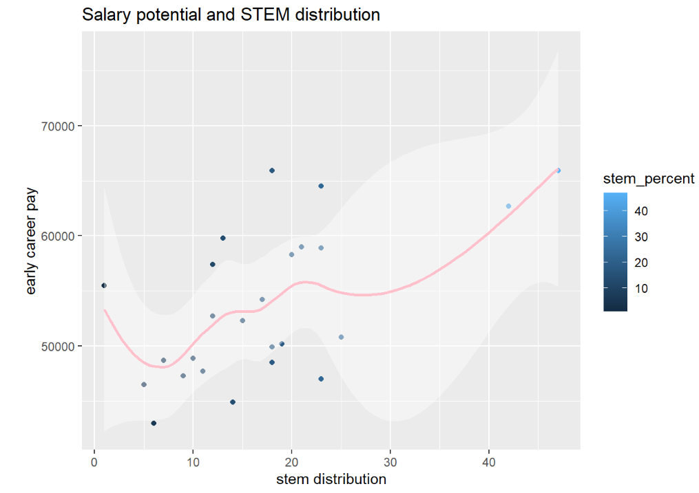
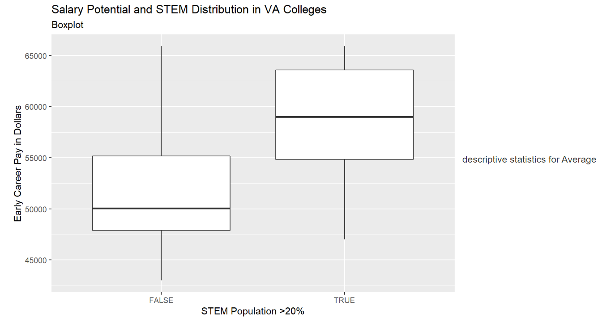

# DS 4001 M1
---

## Table of contents
1. [INTRODUCTION](#introduction)
2. [HYPOTHESIS](#hypothesis)
3. [SRC](#src)
4. [DATA](#data)
5. [FIGURES](#figures)
6. [REFERENCES](#references)

---

## INTRODUCTION
The question we explored pertains to how much of an impact graduating with a STEM (science,
technology, engineering, and math) degree has on early-career salaries. On average, STEM
majors earn $65,000, while non-STEM majors earn about $15,500 less. STEM majors were also
more likely to be employed and hold only one full-time job, rather than a part-time job or
multiple jobs [1]. In addition, STEM workers who majored in a STEM field in college typically
made higher salaries than those who did not: on average, $101,100 vs. $87,600 [2]. According to
a study of 159 college degrees by the personal finance company Bankrate, all 25 of its
top-earning majors are ‘STEM’ majors [3]. Overall, it seems that STEM students, on average,
make more money than non-STEM students. 

**For our project, we will focus on analyzing graduates of college and university in Virginia.**

---

## HYPOTHESIS
***The United States early salary potential for graduates of public and private colleges and
universities in Virginia is at least $5000 higher for colleges and universities that have a
percentage of STEM students above or at 20%.***

---

## SRC
 
This section need to be updated later

---
## DATA
For full data, please click [here](./data/salary_potential.csv)

For the data dictionary, please click [here](./data/Data_Dictionary)

The first six rows of our data set are shown below...

|rank|name                                                            |state_name    |early_career_pay|mid_career_pay|make_world_better_percent|stem_percent|
|----|----------------------------------------------------------------|--------------|----------------|--------------|-------------------------|------------|
|1   |Auburn University                                               |Alabama       |54400           |104500        |51                       |31          |
|2   |University of Alabama in Huntsville                             |Alabama       |57500           |103900        |59                       |45          |
|3   |The University of Alabama                                       |Alabama       |52300           |97400         |50                       |15          |
|4   |Tuskegee University                                             |Alabama       |54500           |93500         |61                       |30          |
|5   |Samford University                                              |Alabama       |48400           |90500         |52                       |3           |
|6   |Spring Hill College                                             |Alabama       |46600           |89100         |53                       |12          |

---

## FIGURES

### Figures Table
* Scatterplot with Trend Line
* Boxplot
* Average Difference between Salaries
* R-Squared Value and Significance Tests

### Scatterplot with Trend Line

### Boxplot

### Average Difference between Salaries

|stem_percent > 20|average|standard deviation|
|-----------------|-------|------------------|
|FALSE|51761|5852|
|TRUE|58400|7074|

### R-Squared Value and Significance Tests
|R-Squared Value|0.5882328|
|---------|---------------|
|P-Value|0.001983|

---

## REFERENCES

[1] P. Jacobs, “Science And Math Majors Earn The Most Money After Graduation - Business
Insider,” *Business Insider*, Jul. 09, 2014. [Online]. Available: https://www.businessinsider.com/stem-majors-earn-a-lot-more-money-after-graduation-2014-7. [Accessed: Sept. 14, 2022].

[2] U. C. Bureau, “Does Majoring in STEM Lead to a STEM Job After Graduation?,” *The
United States Census Bureau*, Jun. 02, 2021.[Online]. Available: https://www.census.gov/library/stories/2021/06/does-majoring-in-stem-lead-to-stem-job-after-gr
aduation.html. [Accessed: Sept. 14, 2022].

[3]“These are the degrees that will earn you the most money when you graduate - and the ones
that won’t,” *World Economic Forum*. [Online]. Available: https://www.weforum.org/agenda/2021/10/stem-degrees-most-valuable/. [Accessed: Sept. 14, 2022].

[4] Mostipak, Jesse. “College Tuition, Diversity, and Pay.” *Kaggle* datasheet, 9 Mar. 2020. Available: https://www.kaggle.com/datasets/jessemostipak/college-tuition-diversity-and-pay?select=historical_tuition.csv. [Accessed: Sept. 14, 2022].

### OTHER LINKS

- Access our MI1 assignment from [here](https://collab.its.virginia.edu/access/content/attachment/856376d0-e4da-47eb-9375-a797b1752c6f/Assignments/793163ca-d95c-4733-9c89-7b8072cf7e87/M1-1%20Hypothesis.pdf) 👋
- Access our MI2 assignment from [here](https://collab.its.virginia.edu/access/content/attachment/856376d0-e4da-47eb-9375-a797b1752c6f/Assignments/9e9b7b2b-222c-49b7-9cdf-ab961fabc74c/M1-2%20Establish%20Data%20to%20Analysis%20Plan%20_1_.pdf) 🤝
